# My Application - Android 架构教学文档

## 目录

1. [项目概览](#1-项目概览)
2. [架构总览](#2-架构总览)
3. [数据层 (Data Layer)](#3-数据层-data-layer)
4. [领域层 (Domain Layer)](#4-领域层-domain-layer)
5. [UI 层 (UI Layer)](#5-ui-层-ui-layer)
6. [导航系统](#6-导航系统)
7. [后台处理](#7-后台处理)
8. [依赖注入](#8-依赖注入)
9. [数据流转模式](#9-数据流转模式)
10. [安全：PIN 哈希](#10-安全pin-哈希)
11. [关键技术决策](#11-关键技术决策)

---

## 1. 项目概览

这是一个**任务管理 Android 应用**，使用 **Jetpack Compose** 和现代 Android 架构组件构建。支持层级化任务（父子任务树）、优先级、彩色分类、带提醒的截止日期，以及 PIN 码保护。

### 技术栈速览

| 维度 | 选择 |
|-----------|--------|
| UI 框架 | Jetpack Compose + Material 3 |
| 架构模式 | MVVM + Repository |
| 数据库 | Room (SQLite) |
| 页面导航 | Navigation Compose |
| 后台任务 | WorkManager |
| 依赖注入 | 手动注入（无框架） |
| 最低/目标 SDK | 35 (Android 15) |
| Kotlin 版本 | 2.2.10 |
| AGP 版本 | 9.2.1 |

### 给不熟悉 Android 开发的读者

下面是一些贯穿全文的核心概念的简要说明，帮你快速入门：

| 概念 | 一句话解释 | 类比 |
|------|-----------|------|
| **Jetpack Compose** | 用 Kotlin 代码直接写 UI，不再需要 XML 布局文件 | 像用 Markdown 写文档——你描述内容，渲染引擎自动处理样式 |
| **Room** | Android 官方的 SQLite 封装库，把数据库表映射为 Kotlin 对象 | 像一个翻译官：你用 Kotlin 说话，它帮你翻译成 SQL 并执行 |
| **ViewModel** | 存放 UI 数据的容器，横竖屏旋转等配置变更时数据不会丢失 | 像开会时的小白板——不管会议室怎么布置，白板上的内容还在 |
| **Flow / StateFlow** | 随时间推送数据的数据流，接收方自动收到最新值 | 像微信群消息——有人发消息，群里所有人实时看到 |
| **Coroutines (协程)** | Kotlin 的异步编程方式，写起来像同步代码，实际是非阻塞的 | 像餐厅里的服务员——可以同时处理多桌客人，不用等一桌吃完再服务下一桌 |
| **Navigation Compose** | 管理页面之间跳转的库 | 像浏览器里的前进/后退按钮 |
| **WorkManager** | 即使 App 关闭也能定时执行的后台任务系统 | 像手机闹钟——即使你没在用手机，闹钟也会按时响起 |

### 开发环境与工具链

Android 开发和普通 Java/Kotlin 程序不同，有一套专门的工具链。以下是最基础的入门知识。

#### Android Studio —— 开发的主战场

Android Studio 是 Google 官方的 IDE（集成开发环境），基于 JetBrains IntelliJ IDEA。它包含了开发 Android 应用所需的一切：

| 功能 | 用途 |
|------|------|
| 代码编辑器 | 写 Kotlin/Java 代码，带智能补全 |
| 布局预览 | 在 IDE 里直接看 Compose 渲染效果，不用每次跑 App |
| 模拟器管理 | 创建、启动、配置虚拟 Android 设备 |
| Logcat | 查看应用运行时输出的日志 |
| 调试器 | 设置断点、单步执行、查看变量值 |
| 性能分析器 | 监控 CPU、内存、网络使用情况 |
| APK 打包 | 生成可直接安装的安装包 |

#### 模拟器 vs 真机

开发时有两种运行方式：

| 方式 | 优点 | 缺点 |
|------|------|------|
| **Android 模拟器** | 可模拟各种设备型号和系统版本、不用插手机 | 启动较慢、吃电脑内存、不能测 NFC/蓝牙等硬件功能 |
| **真机调试** | 真实性能表现、能测所有硬件功能 | 需要 USB 连接、需要打开开发者选项和 USB 调试 |

日常开发多用模拟器，发布前必须用真机测试。

#### Gradle + AGP —— 构建系统

Android 项目使用 **Gradle** 作为构建工具，**AGP（Android Gradle Plugin）** 是 Gradle 的 Android 插件。

**类比**：Gradle 就像一个**自动化流水线**——你定义了"原材料在哪儿"、"加工步骤是什么"、"成品放在哪儿"，然后它自动把所有事情做完。AGP 则是流水线上专门处理 Android 特有流程的机器。

从源代码到 APK 的完整过程：

```
源代码 (Kotlin/Java)
    │
    ▼
Kotlin/Java 编译器 → .class 字节码
    │
    ▼
Dex 转换器 → .dex 文件（Android 虚拟机格式）
    │
    ▼
资源打包器 → 资源文件 + .dex → 合并
    │
    ▼
签名 → APK (可安装的应用包)
```

**关键文件：**

- `build.gradle.kts`（项目级）—— 定义项目全局配置，如插件版本
- `build.gradle.kts`（模块级）—— 定义具体模块的依赖、SDK 版本、编译选项
- `settings.gradle.kts` —— 定义项目包含哪些模块
- `gradle.properties` —— Gradle 属性配置（内存、并行等）

#### SDK 与 API Level

**SDK (Software Development Kit)** 是开发工具包，包含编译所需的系统 API 和工具。

**API Level** 是一个整数，标记 Android 系统版本。每个 Android 版本对应一个 API Level：

| API Level | Android 版本 | 代表性特性 |
|-----------|-------------|-----------|
| 31 | Android 12 | Material You 动态取色 |
| 33 | Android 13 | 通知运行时权限 |
| 34 | Android 14 | 更严格的后台限制 |
| 35 | Android 15 | 本应用的目标版本 |

本应用 `minSdk = 35`（最低支持 Android 15），意味着它只能在 Android 15 及以上设备运行。这是一个很高的要求——常规应用通常设置 `minSdk = 24~26`（覆盖 95%+ 的设备）。

#### Logcat —— 调试的眼睛

Logcat 是 Android 的**实时日志系统**。App 运行时的所有输出都在这里。在你的代码中：

```kotlin
Log.d("MyApp", "任务创建成功，ID: $taskId")
Log.e("MyApp", "数据库查询失败", exception)
```

日志有不同级别：

| 级别 | 方法 | 用途 |
|------|------|------|
| `D` (Debug) | `Log.d()` | 开发调试信息 |
| `I` (Info) | `Log.i()` | 一般信息 |
| `W` (Warning) | `Log.w()` | 警告 |
| `E` (Error) | `Log.e()` | 错误 |

> Android Studio 的 Logcat 窗口可以按级别过滤、搜索关键字。出现问题时首先应该看 Logcat，这就像医生看病先量体温。

#### 调试器 —— 让程序"暂停"

Android Studio 内置调试器，可以：

1. **设置断点**——程序运行到某一行自动暂停
2. **单步执行**——一行一行地执行代码
3. **查看变量**——暂停时查看当前所有变量的值
4. **条件断点**——只在满足条件时暂停（如"当 `taskId == 0` 时暂停"）

这个能力用于排查复杂的逻辑 bug。如果 Logcat 不能帮你定位问题，下一步就是上调试器。

#### Android 项目的目录结构

一个典型的 Android 项目长这样：

```
MyApp/
├── app/                              ← 主模块（应用代码）
│   ├── build/                        ← 编译产物（自动生成，不要改）
│   ├── src/
│   │   ├── main/
│   │   │   ├── java/...              ← Kotlin 源码
│   │   │   ├── res/                  ← 资源文件（图片、字符串等）
│   │   │   └── AndroidManifest.xml   ← 应用声明文件（权限、组件注册）
│   │   ├── test/                     ← 单元测试
│   │   └── androidTest/              ← 需要模拟器/真机的测试
│   └── build.gradle.kts              ← 模块级构建配置
├── build.gradle.kts                  ← 项目级构建配置
├── settings.gradle.kts               ← 项目结构配置
├── gradle.properties                 ← Gradle 属性
└── gradlew / gradlew.bat             ← Gradle Wrapper 脚本
```

**几个新手容易困惑的点：**
- `build/` 目录是编译产物，删掉也没关系，下次编译会重新生成
- `res/` 里的资源文件（图片、字符串等）会被自动生成 ID，在代码中通过 `R.string.xxx` 引用
- `AndroidManifest.xml` 是应用的"配置文件"，声明了应用名、权限、有哪些页面等

---

## 2. 架构总览

### 2.1 什么是 MVVM？

MVVM 是一种三件套架构模式。用一个**餐厅点餐**的比喻：

| 角色 | MVVM 中的对应 | 餐厅中的职责 |
|------|-------------|------------|
| **View（视图）** | Compose 写的 UI 页面 | 餐厅的**就餐区**——顾客看到菜单、看到菜、看到服务员 |
| **ViewModel（视图模型）** | 连接 UI 和数据的中间层 | **服务员**——顾客告诉服务员要点什么，服务员去后厨下单、取菜、端回来 |
| **Model（模型）** | 数据库、网络请求等数据来源 | **后厨**——真正做菜的地方，只管做菜，不关心谁来吃 |

**关键规则**：
- View 和 Model **不直接对话**——顾客不会自己跑到后厨炒菜
- ViewModel 是中间人——服务员把顾客的意图传给后厨，再把菜端回来
- ViewModel **不持有 View 的引用**——服务员不认识具体的顾客，他只负责把菜放到桌上，至于谁坐那个位置他不管

这就是为什么这几个字母叫 MVVM：
```
View  ←  ViewModel  →  Model
(UI)     (中间人)      (数据)
```

**为什么不用 MVC？** 在传统 MVC 中，Controller 会越来越臃肿（所谓 Massive View Controller 问题）。MVVM 的 ViewModel 通过数据绑定自动同步 UI 和数据，减少了手动更新 UI 的样板代码。

### 2.2 本应用的架构图

本应用采用**三层 MVVM 架构**：

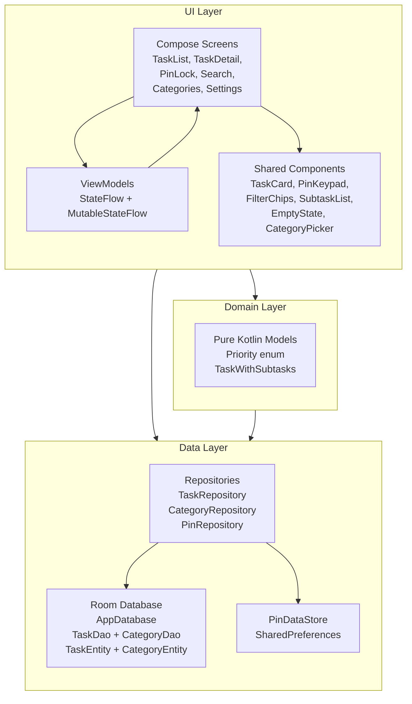

### 2.3 各层职责

**UI 层** — Compose 页面渲染 ViewModel 中的状态数据。ViewModel 持有 `StateFlow<UiState>` 并提供操作函数。页面通过 `collectAsState()` 观察状态变化，在用户操作时调用 ViewModel 的操作函数。共享组件是无状态的、可复用的。

> 新手理解：UI 层的核心思想是"**声明式**"——你不需要写"先把旧文本删掉，再插入新文本，再刷新显示"，你只需要说"这块文字的值等于 state.title"，当 state.title 变了，UI 自动更新。这就像 Excel 公式——你把公式写好，数据变了数字自动跟着变。

**领域层** — 刻意保持在最小规模。只包含纯 Kotlin 模型（`Priority` 枚举，`TaskWithSubtasks` 递归数据类）。没有 Use Case/Interactor 类——当前应用复杂度还不需要。

**数据层** — Repository 封装了不同的数据源（Room DAO、SharedPreferences）。对外暴露基于 `Flow` 的响应式数据流，以及挂起函数形式的写入操作。Room 数据库是唯一的数据来源。

### 2.4 依赖规则

依赖方向是**向内、向下**的：UI → Domain → Data。UI 层直接依赖 Data 层的类型（`TaskEntity`、`CategoryEntity`）——没有做类型映射转换。这是一个务实的选择，适合当前项目规模。

---

## 3. 数据层 (Data Layer)

### 3.1 什么是 Room？

Room 是 Google 官方的数据库库。它做了两件事：

1. **把 Kotlin 类映射为数据库表**——你写一个 `data class TaskEntity`，Room 自动生成对应的 SQL 建表语句
2. **把 Kotlin 函数映射为 SQL 查询**——你在接口里写 `@Query("SELECT * FROM tasks")`，Room 自动帮你执行并返回 Kotlin 对象

类比：Room 就像一个**自动翻译机**——你用 Kotlin 语言说"我想要所有任务"，它帮你翻译成 `SELECT * FROM tasks`，执行后把结果翻译回 Kotlin 对象给你。

### 3.2 数据库初始化

Room 数据库使用**单例模式**，双重检查锁定（double-checked locking）：

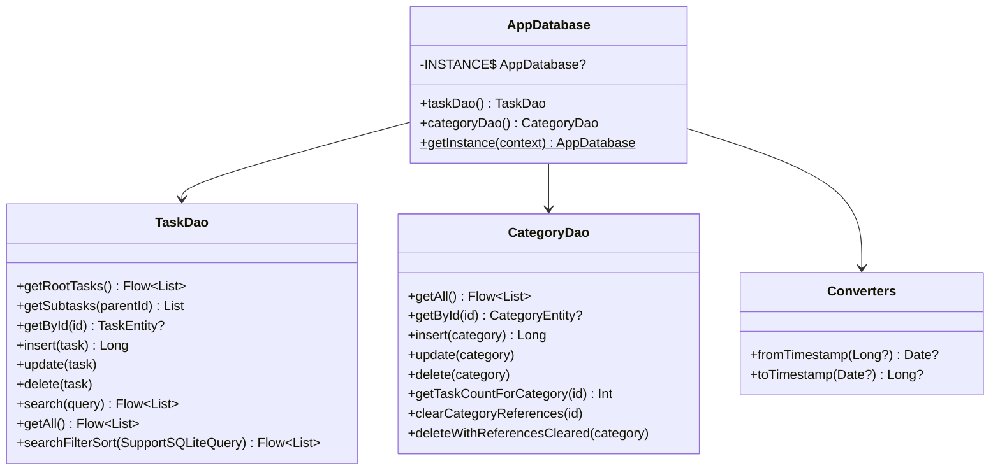

**关键点：**
- `@Volatile` 确保单例在多线程下的可见性
- `synchronized(this)` 防止并发创建导致多个实例
- `exportSchema = false`（App 开发中的常见设置）
- 数据库文件：`task_app.db`，版本 1

### 3.3 实体与关系

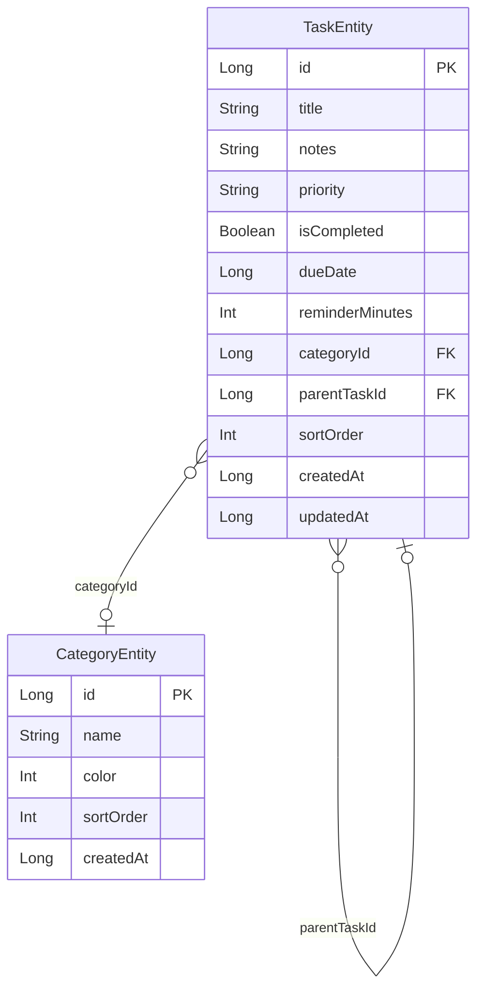

**关于外键**：`TaskEntity.categoryId` 和 `parentTaskId` 均未声明 Room 的 `@ForeignKey` 注解——它们只是普通的可空 `Long` 列，关系存在于语义层面而非数据库约束层面。这意味着：
- 删除父任务时，`TaskRepository.deleteTask()` 通过递归删除子任务来保证没有悬空引用（见 3.5 节）。
- 删除分类时，`CategoryRepository.deleteCategory()` 在事务中先将所有引用该分类的任务的 `categoryId` 置为 `NULL`，再执行删除（级联清空）。

**自引用层级结构**：`TaskEntity` 中的 `parentTaskId` 字段指向另一条任务的 `id`，形成了树状结构。根任务（最顶层的任务）的 `parentTaskId IS NULL`。子任务下还可以有子任务（无限深度）。就像一个文件夹系统——文件夹里可以有文件和子文件夹，子文件夹里还可以再有子文件夹。

**优先级存储为字符串**：`"HIGH"`、`"MEDIUM"`、`"LOW"` 直接存为字符串。虽然不如枚举类型安全，但避免了额外的类型转换器，并且可以做 SQL 排序：`ORDER BY CASE priority WHEN 'HIGH' THEN 0 ...`。

**分类颜色**：存储为 ARGB `Int`。UI 端直接用 `Color(category.color)` 解析。

### 3.4 DAO 设计模式

DAO（Data Access Object，数据访问对象）是 Room 的核心概念——它是一个接口，定义了所有数据库操作的入口。

**使用 Flow 的响应式读取**：
```kotlin
@Query("SELECT * FROM tasks WHERE parentTaskId IS NULL ORDER BY ...")
fun getRootTasks(): Flow<List<TaskEntity>>
```
Room 会在底层数据表变化时**自动**重新发送数据。这是整个应用响应能力的基础——不需要手动刷新。

> 类比：这就像你订阅了一个 YouTube 频道——频道主发了新视频，你自动收到通知。你不用每隔五分钟去检查有没有更新。

**详情页的单次读取**：
```kotlin
@Query("SELECT * FROM tasks WHERE id = :id")
suspend fun getById(id: Long): TaskEntity?
```
用于 `TaskDetailViewModel` 加载单条任务进行编辑。

**Worker 的快照读取**：
```kotlin
@Query("SELECT * FROM tasks")
suspend fun getAllSnapshot(): List<TaskEntity>
```
WorkManager 的 `CoroutineWorker` 不能订阅 Flow（它只运行一次就返回结果），所以需要用快照查询获取当时的数据。

**根任务的排序逻辑**：
```sql
ORDER BY isCompleted ASC,
  CASE priority WHEN 'HIGH' THEN 0 WHEN 'MEDIUM' THEN 1 ELSE 2 END,
  sortOrder ASC
```
已完成的任务沉到最底部。活跃任务按优先级排序（HIGH 优先），同优先级按手动的 `sortOrder` 排列。

### 3.5 Repository（仓库）

Repository 是 DAO 和 ViewModel 之间的中间层，封装数据操作：

```
ViewModel  -->  Repository  -->  DAO / DataStore
```

**TaskRepository** — 最复杂的仓库。核心操作：

| 方法 | 类型 | 说明 |
|--------|------|-------|
| `rootTasks` | `Flow<List<TaskEntity>>` | 响应式根任务流 |
| `createTask(...)` | `suspend → Long` | 返回新任务 ID |
| `updateTask(task)` | `suspend` | 自动更新时间戳 |
| `toggleComplete(id)` | `suspend` | 切换完成状态 |
| `deleteTask(id)` | `suspend` | **递归删除**——先删所有子任务 |
| `buildTaskTree(parentId?)` | `suspend → List<TaskWithSubtasks>` | 构建递归任务树 |
| `search(query)` | `Flow<List<TaskEntity>>` | 全文搜索标题和备注 |
| `searchFilterSort(...)` | `Flow<List<TaskEntity>>` | 动态 SQL 搜索 + 过滤 + 排序，全部在数据库执行 |

**递归删除模式**值得关注：
```kotlin
suspend fun deleteTask(taskId: Long) {
    for (sub in dao.getSubtasks(taskId)) {
        deleteTask(sub.id)  // 深度优先递归
    }
    dao.deleteById(taskId)
}
```
在删除父任务之前，先遍历删除整棵子树，确保不会产生孤立数据。

**CategoryRepository** — 分类操作的封装层。通过 `Flow` 暴露分类列表。`deleteCategory()` 委托给 DAO 的 `@Transaction` 方法 `deleteWithReferencesCleared()`：在一个事务中先将所有引用该分类的任务的 `categoryId` 清空为 `NULL`，再删除分类，保证不会产生悬空引用。

**PinRepository** — 连接 `PinHasher` 和 `PinDataStore`：
```kotlin
fun setPin(pin: String) {
    pinDataStore.setPinSync(PinHasher.hash(pin))  // 先哈希再存储
}
fun verifyPin(pin: String): Boolean = pinDataStore.verifyPinSync(pin)
```

### 3.6 PIN 安全层

PIN 系统有三层：

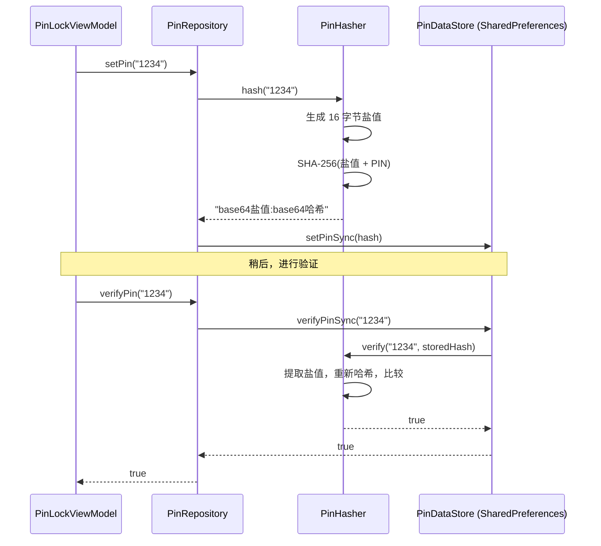

**PinHasher 设计思路**：
- 使用 **SHA-256** 加随机 **16 字节盐值（salt）**
- salt 通过 `SecureRandom` 生成（加密级别的随机数）
- 输出格式：`"base64(salt):base64(hash)"` — 自包含设计，无需单独保存盐值
- `verify()` 从存储字符串中提取盐值，用相同盐值重新计算哈希，然后比较
- 对于 4 位 PIN 来说（只有 10000 种组合），盐值是防止预计算彩虹表攻击的关键

**PinDataStore** — 封装 `SharedPreferences`（文件名为 `pin_prefs`）。使用同步操作，因为 PIN 操作很快（< 1ms），且流程是简单的状态机，不需要协程。

---

## 4. 领域层 (Domain Layer)

领域层刻意保持最小规模——只有两个文件：

### Priority 枚举
```kotlin
enum class Priority { HIGH, MEDIUM, LOW }
```
定义了但**不作为存储类型使用**——数据库以字符串形式存储。这个枚举是为了将来如果迁移到基于枚举的存储方式时提供类型安全。

### TaskWithSubtasks
```kotlin
data class TaskWithSubtasks(
    val task: TaskEntity,
    val subtasks: List<TaskWithSubtasks> = emptyList(),
)
```
一个**递归数据结构**，表示任务树。每个节点包含一个任务和它的子任务列表，子任务同样是 `TaskWithSubtasks` 节点。由 `TaskRepository.buildTaskTree()` 递归构建。

> 类比：这就像文件系统的目录结构——每个文件夹包含一些文件，也可能包含子文件夹，子文件夹还可以继续包含。

这个模型用于：
- `TaskDetailScreen` — 页面内显示子任务树
- `SubtaskList` 组件 — 带缩进渲染递归树

---

## 5. UI 层 (UI Layer)

### 5.1 Jetpack Compose 是什么？

傳統 Android 开发用 XML 写布局——你需要一个 `activity_main.xml` 文件描述界面长什么样，然后在代码里 `findViewById` 找到各个组件进行操作。这就像用 HTML 写网页布局。

**Jetpack Compose 改变了这个方式**——它让你直接用 Kotlin 代码描述 UI：

```kotlin
// 传统 XML 方式：写一个 xml 文件，然后在 Kotlin 中 findViewById
// Compose 方式：直接在 Kotlin 中描述 UI
@Composable
fun Greeting(name: String) {
    Text(text = "你好，$name!")
}
```

核心理念是**声明式 UI**：

| 方式 | 怎么做 | 类比 |
|------|-----------|------|
| **命令式**（传统） | "先查找到这个 TextView，再设置它的文本为 XXX，再改变它的颜色" | 你告诉司机：先在第一个路口左转，然后走 300 米，再右转…… |
| **声明式**（Compose） | "这里显示一段文字，内容是 name，颜色是红色" | 你告诉司机：我要去北京饭店。怎么走，司机自己知道。 |

当数据（state）改变时，Compose 自动重新渲染受影响的 UI 部分——你不用手动更新任何东西。

### 5.2 什么是 ViewModel？

ViewModel 是**存放 UI 状态的容器**。它有一个重要特性：当手机旋转屏幕（Activity 销毁重建）时，ViewModel 不会被销毁。

**没有 ViewModel**：旋转屏幕 → Activity 销毁 → 数据丢失 → 重新加载

**有 ViewModel**：旋转屏幕 → Activity 销毁 → ViewModel 还在 → UI 重建时直接拿回原来的数据

```kotlin
// ViewModel 的典型写法
class CounterViewModel : ViewModel() {
    // 私有可写，公开只读
    private val _count = MutableStateFlow(0)
    val count: StateFlow<Int> = _count.asStateFlow()

    fun increment() {
        _count.update { it + 1 }
    }
}

// Compose 页面中使用
@Composable
fun CounterScreen(viewModel: CounterViewModel) {
    val count by viewModel.count.collectAsState()  // 自动订阅，值变了就刷新
    Button(onClick = { viewModel.increment() }) {
        Text("点击次数: $count")
    }
}
```

### 5.3 主题系统

Material 3 支持**动态取色**：

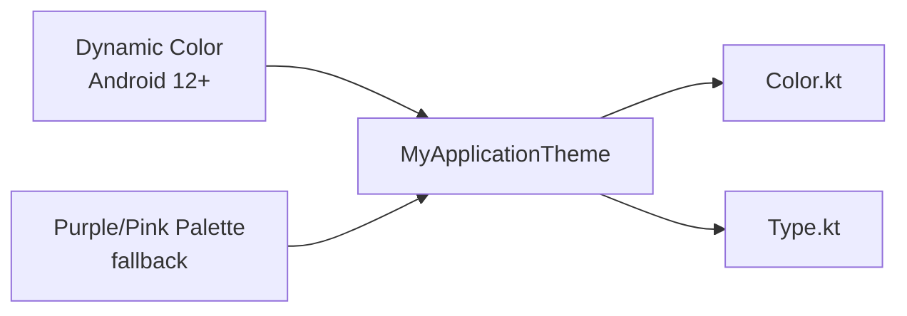

- Android 12+ 设备从用户壁纸提取配色方案
- 低版本设备回退到紫色主色 + 粉色辅色
- `enableEdgeToEdge()` 实现现代无边距渲染

### 5.4 组件清单

| 组件 | 类型 | 输入 | 用途 |
|-----------|------|------|-------|
| `TaskCard` | 无状态 | `TaskEntity`、子任务数、分类名、分类颜色、回调 | 任务列表项、搜索结果 |
| `FilterChips` | 无状态 | `selected: String`、`onSelect` | 全部/今天/本周/高优先 过滤条 |
| `PinKeypad` | 无状态 | `onDigit: (Int)->Unit`、`onDelete` | PIN 输入界面 |
| `PinDotIndicator` | 无状态 | `count`、`hasError` | PIN 输入反馈 |
| `CategoryPicker` | 有状态（弹窗） | `categories`、`selectedId`、`onSelect` | 底部弹出分类选择 |
| `PriorityPicker` | 无状态 | `selected`、`onSelect` | 高/中/低 选择条 |
| `SubtaskList` | 递归 | `subtasks: List<TaskWithSubtasks>`、`level` | 缩进可展开的子任务树 |
| `EmptyState` | 无状态 | `message: String` | 收件箱图标 + 提示信息 |

**有状态 vs 无状态组件**：
- **无状态（Stateless）**：组件自己不管数据，数据由外部传入。像一个**纯展示的卡片**——你给它什么它就显示什么，它不关心数据从哪来。
- **有状态（Stateful）**：组件内部管理一些数据。比如 `CategoryPicker` 内部管理弹窗的打开/关闭状态。

### 5.5 关键组件详解

**`SubtaskList` 递归组件**：
```kotlin
@Composable
fun SubtaskList(subtasks: List<TaskWithSubtasks>, level: Int = 0, ...) {
    subtasks.forEach { item ->
        // 按 level * 24.dp 的缩进渲染当前层级
        if (expanded && item.subtasks.isNotEmpty()) {
            SubtaskList(item.subtasks, level + 1, ...)  // 递归！
        }
    }
}
```
每深入一层，缩进增加 24dp。就像在文件管理器中逐层展开文件夹。

**`PinDotIndicator` 弹性动画**：
```kotlin
val offsetX by animateDpAsState(
    targetValue = if (hasError) 10.dp else 0.dp,
    animationSpec = spring(),  // 弹簧动画
)
```
PIN 输入错误时产生水平抖动效果——就像 iOS 密码输入错误时的抖动。

### 5.6 ViewModel 的两种写法

本应用展示了两种 ViewModel 写法，适用于不同场景。

#### 写法 A：`stateIn()` 配合 Flow 链式处理（用于列表类页面）

使用者：`TaskListViewModel`、`CategoriesViewModel`、`SearchViewModel`

```kotlin
val state: StateFlow<UiState> = combine(/* 多个 Flow */)
    .flatMapLatest { /* 数据转换 */ }
    .stateIn(viewModelScope, SharingStarted.WhileSubscribed(5000), UiState())
```

**逐步解释：**
1. `combine(...)` — 把多个数据流合并成一个。比如同时监听"当前过滤条件"和"所有分类列表"
2. `flatMapLatest {}` — 当合并后的数据变了，自动切换处理逻辑
3. `stateIn(..., WhileSubscribed(5000), ...)` — 把冷流转为热流，5 秒超时
   - **冷流 vs 热流**：冷流像**点播视频**——有人看才开始播；热流像**电视台直播**——不管你开不开电视，信号一直在播
   - `WhileSubscribed(5000)`：最后一个订阅者离开后，等 5 秒才关闭上游。这个 5 秒是为了覆盖屏幕旋转的时间——屏幕旋转时旧的 Compose 销毁、新的创建，通常不到 1 秒。如果在 5 秒内恢复订阅，不用重新查询数据库。

#### 写法 B：`MutableStateFlow` + `update {}`（用于表单/单个实体页面）

使用者：`TaskDetailViewModel`、`PinLockViewModel`、`SettingsViewModel`

```kotlin
private val _state = MutableStateFlow(UiState())
val state: StateFlow<UiState> = _state.asStateFlow()

fun setTitle(t: String) { _state.update { it.copy(title = t) } }
```

**逐步解释：**
1. `MutableStateFlow` — 可修改的状态容器，初始值是 `UiState()`
2. `asStateFlow()` — 对外暴露只读版本，外部只能读不能直接改
3. `update {}` — 原子操作，确保读取和写入之间不会被其他线程打断
4. `it.copy(title = t)` — Kotlin data class 的复制方法，不改原对象，返回一个新的（**不可变数据**）

这是每个表单字段对应一个 setter 函数的写法。

### 5.7 页面详解

#### PinLockScreen（PIN 锁屏）

**ViewModel 状态机：**

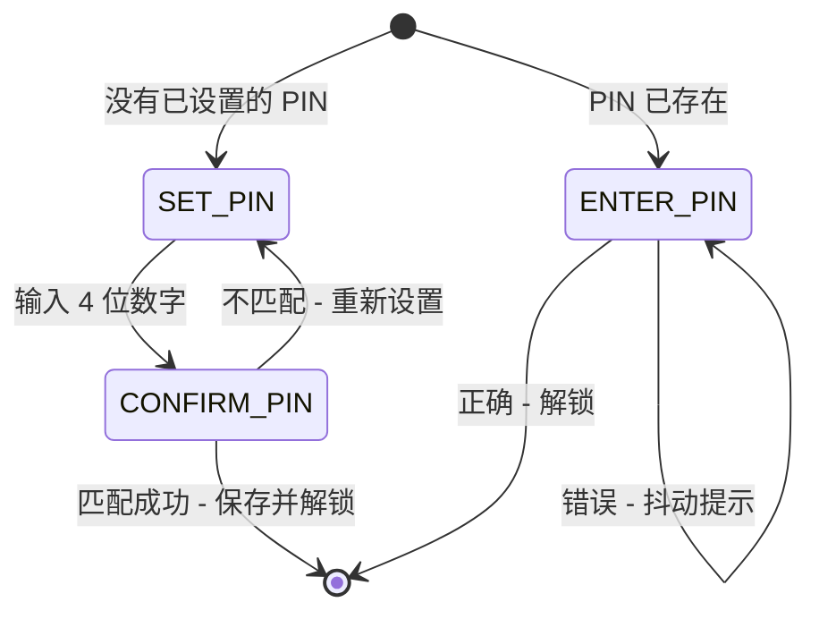

三种模式由 `PinLockViewModel.Mode` 驱动：
- `SET_PIN` — 首次设置，没有已存储的 PIN
- `CONFIRM_PIN` — 再次输入确认
- `ENTER_PIN` — 正常解锁流程

页面使用 `LaunchedEffect(state.unlocked)` 在解锁成功时触发导航。

#### TaskListScreen（任务列表页）

**过滤 + 响应式列表模式：**

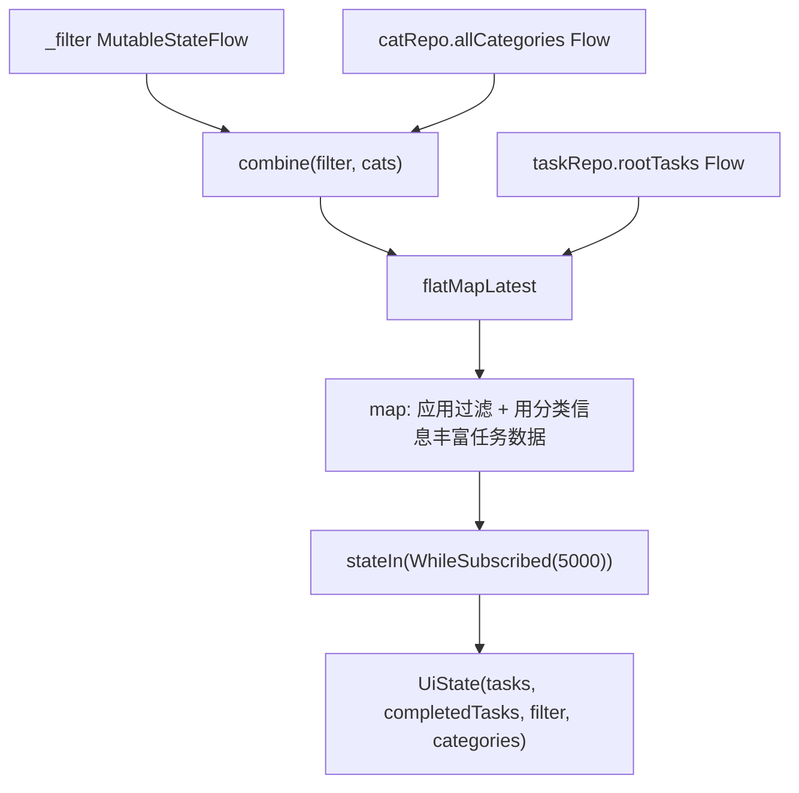

ViewModel 用分类信息丰富任务实体（`TaskItem`），并分离为活跃/已完成两个列表。过滤是在客户端对已加载的根任务进行的——对于预期的数据量来说够用。

**UI 特性：**
- 可折叠的"已完成 (N)"区域，带展开/收起开关
- 滑动删除
- 右下角 FAB 按钮创建新任务
- 右上角菜单：分类管理和设置

#### TaskDetailScreen（任务详情页）

**带子任务管理的创建/编辑表单：**

- 路由参数 `taskId` 决定模式：`0` = 新建，`>0` = 编辑已有任务
- `parentTaskId` 参数将新子任务链接到父任务
- 表单字段：标题、备注、优先级（选择条）、截止日期（Material3 日期选择器）、提醒（7 个预设选项）、分类（底部弹出选择）
- 子任务区域：递归树展示 + 内嵌添加表单
- 保存时验证标题非空，然后调用 `createTask()` 或 `updateTask()`

#### SearchScreen（搜索页）

**多维度过滤 + 排序——全部在数据库层执行：**

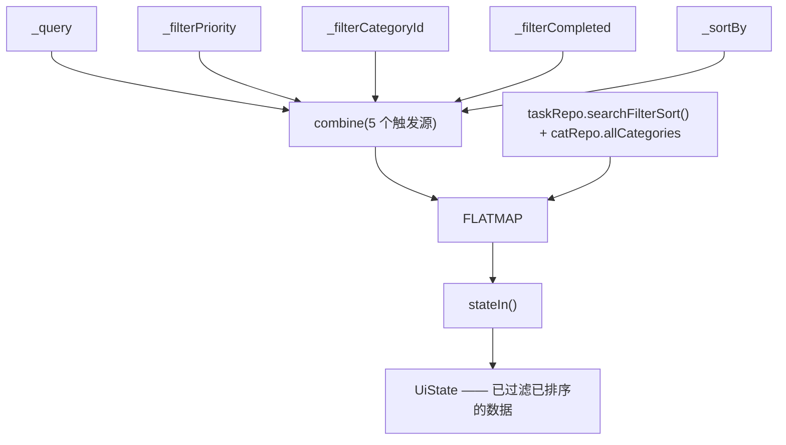

搜索、过滤（优先级、分类、完成状态）和排序全部通过动态构建的 SQL 查询在 Room 中执行。`TaskRepository.searchFilterSort()` 根据参数动态拼接 WHERE 子句和 ORDER BY 子句，使用 `@RawQuery` + `SimpleSQLiteQuery` 支持灵活的查询组合，避免将大量数据加载到内存再过滤。

#### CategoriesScreen（分类管理页）

简单的增删改查页面。创建/编辑使用 `AlertDialog`，包含文本输入框和 9 色调色板。删除有确认对话框。

#### SettingsScreen（设置页）

**修改 PIN 向导** — 三步状态机（当前 PIN → 新 PIN → 确认新 PIN）：
1. 输入当前 PIN 验证身份
2. 输入新的 4 位 PIN
3. 确认新 PIN
4. 第 3 步输入不一致时，回到第 2 步

使用和 `PinLockScreen` 相同的 `PinKeypad` 组件，但有不同的 ViewModel 状态机。

---

## 6. 导航系统

### 6.1 Navigation Compose 是什么？

Navigation Compose 是管理"页面之间跳转和返回"的库。你需要定义每个页面（称为"路由"），然后告诉导航器在什么条件下跳转到哪个页面。

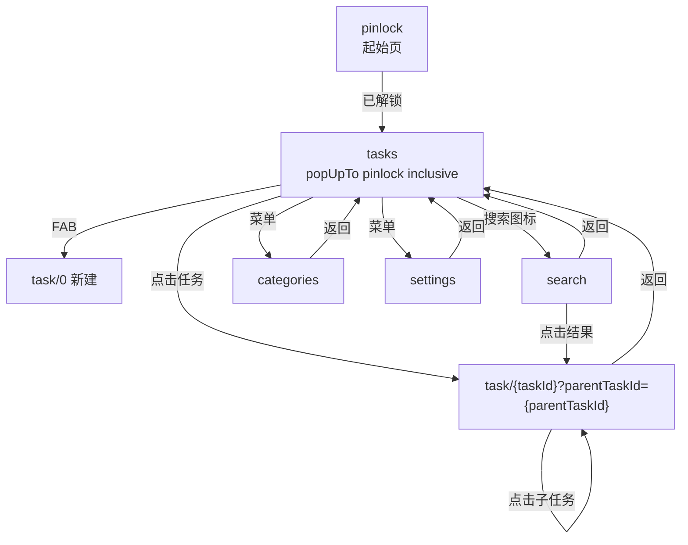

### 6.2 路由设计

| 路由 | 参数 | 说明 |
|-------|-----------|-------|
| `pinlock` | 无 | 起始页面 |
| `tasks` | 无 | 主列表，跳转时从返回栈中移除 PIN 页 |
| `task/{taskId}?parentTaskId={parentTaskId}` | `taskId: Long`、`parentTaskId: Long?` | `parentTaskId` 默认 `-1` 表示 null |
| `categories` | 无 | 分类管理 |
| `settings` | 无 | 修改 PIN |
| `search` | 无 | 全文搜索 |

**关键导航细节：**
- PIN 解锁后使用 `popUpTo(PIN_LOCK) { inclusive = true }` — PIN 页面从返回栈中移除，所以在任务列表按返回键会退出 App，而不是回到 PIN 页面。
- 任务详情页支持深层导航：查看子任务会导航到新的 `task/{id}` 实例，形成详情页的导航栈。
- `taskId=0` 是"新建任务"的约定——ViewModel 通过 `taskId == 0L` 判断是创建还是编辑模式。

### 6.3 页面跳转方法

Navigation Compose 提供两种核心操作来切换路由：

**前进（跳转到新页面）：**
```kotlin
navController.navigate(Routes.TASK_LIST)
navController.navigate(Routes.taskDetail(id))  // 带参数
navController.navigate(Routes.taskDetail(0))   // taskId=0 约定为"新建任务"
```

**返回（回到上一页）：**
```kotlin
navController.popBackStack()
```

**跳转并清除之前的页面：**
用 `popUpTo` 把指定路由从返回栈中移除：
```kotlin
// NavGraph.kt 第 52 行 —— PinLock 实际代码
onUnlocked = {
    navController.navigate(Routes.TASK_LIST) {
        popUpTo(Routes.PIN_LOCK) { inclusive = true }
    }
}
```
`inclusive = true` 表示连 `PIN_LOCK` 自己也从栈中移除，按返回键不会回到 PinLock，而是直接退出应用。

**项目中的实际使用：**

`TASK_LIST` — 有 5 种跳转，无返回（作为主页面，不设 onBack）：
```kotlin
// NavGraph.kt 第 56-65 行 — 实际代码
composable(Routes.TASK_LIST) {
    val vm: TaskListViewModel = viewModel(factory = TaskListViewModel.Factory(taskRepo, catRepo))
    TaskListScreen(
        viewModel = vm,
        onTaskClick  = { id -> navController.navigate(Routes.taskDetail(id)) },
        onNewTask    = { navController.navigate(Routes.taskDetail(0)) },
        onSearch     = { navController.navigate(Routes.SEARCH) },
        onCategories = { navController.navigate(Routes.CATEGORIES) },
        onSettings   = { navController.navigate(Routes.SETTINGS) },
    )
}
```

`CATEGORIES` / `SETTINGS` —— 只有返回：
```kotlin
// NavGraph.kt 第 88-95 行 — 实际代码
CategoriesScreen(viewModel = vm, onBack = { navController.popBackStack() })
SettingsScreen(viewModel = vm, onBack = { navController.popBackStack() })
```

`SEARCH` — 返回 + 跳转详情：
```kotlin
// NavGraph.kt 第 98-101 行 — 实际代码
SearchScreen(
    viewModel = vm,
    onBack = { navController.popBackStack() },
    onTaskClick = { id -> navController.navigate(Routes.taskDetail(id)) },
)
```

**方法速查：**

| 方法 | 效果 |
|------|------|
| `navController.navigate("route")` | 跳转到目标路由，压入返回栈 |
| `navController.popBackStack()` | 弹出当前路由，返回上一页 |
| `navigate("route") { popUpTo("old") { inclusive = true } }` | 跳转的同时清除返回栈中的旧页面 |

### 6.4 ViewModel Factory 模式

没有 DI 框架的情况下，每个 ViewModel 都有一个内部 `Factory` 类实现 `ViewModelProvider.Factory`：

```kotlin
class Factory(
    private val taskRepo: TaskRepository,
    private val catRepo: CategoryRepository,
) : ViewModelProvider.Factory {
    @Suppress("UNCHECKED_CAST")
    override fun <T : ViewModel> create(modelClass: Class<T>): T =
        TaskListViewModel(taskRepo, catRepo) as T
}
```

`@Suppress("UNCHECKED_CAST")` 是必要的，因为泛型强转在编译时无法验证。这是手动 DI 的通用模式。

---

## 7. 后台处理

### 7.1 WorkManager 是什么？

WorkManager 是 Android 的后台任务调度库。它保证你的任务最终会执行——无论 App 是否在前台、手机是否重启。

> 类比：WorkManager 就像**房间里的计时器**——即使主人不在家，计时器到了时间还是会响。

### 7.2 ReminderWorker（提醒 Worker）

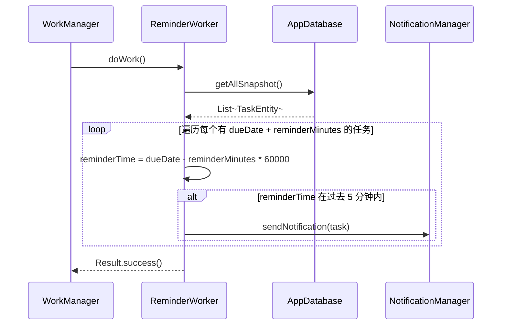

**设计决策：**
- **5 分钟窗口**：`reminderTime <= now && reminderTime > now - 5 minutes` — 这个窗口考虑了 WorkManager 的不精确计时。周期性 Worker 可能延迟触发，窗口确保提醒仍然能被捕获。
- **直接访问数据库**：Worker 绕过 Repository，直接访问 `AppDatabase`。这是有意为之——避免依赖 Activity 的生命周期，可以在任何进程状态下工作。
- **通知 ID**：`1000 + task.id` 确保每条任务有唯一稳定的通知 ID。更新同一条任务的提醒会替换旧通知而不是创建重复通知。
- **POST_NOTIFICATIONS 权限检查**：Android 13+ 需要运行时通知权限。Worker 在 `notify()` 调用前做了权限检查。

### 7.3 通知渠道

在 `MyApp.onCreate()` 中创建（Application 子类）：
```kotlin
NotificationChannel(CHANNEL_ID, "Task Reminders", IMPORTANCE_HIGH)
```
`IMPORTANCE_HIGH` 确保通知有声音且作为横幅弹出。

### 7.4 调度

`ReminderWorker` 已定义，但 `PeriodicWorkRequest` 尚未在代码中调度。这是一个待完成的集成——Worker 基础设施已就绪，调度通常会在任务创建/更新时触发。

**概念化的调度方式：**
```kotlin
val request = PeriodicWorkRequestBuilder<ReminderWorker>(15, TimeUnit.MINUTES).build()
WorkManager.getInstance(context).enqueueUniquePeriodicWork(
    "reminders", ExistingPeriodicWorkPolicy.KEEP, request
)
```

---

## 8. 依赖注入

### 8.1 为什么需要依赖注入？

先看一段**没有依赖注入**的代码：

```kotlin
class TaskListViewModel {
    private val db = AppDatabase.getInstance(context)  // ViewModel 自己去找数据库
    private val taskDao = db.taskDao()
    // ...
}
```

问题：ViewModel 需要知道数据库从哪来、怎么创建。如果要给这个 ViewModel 写测试，你必须准备一个真实的数据库。而且 `context` 是个 Android 类，单元测试跑不起来。

**有依赖注入**的代码：

```kotlin
class TaskListViewModel(
    private val taskRepo: TaskRepository,  // 别人给我，我不自己找
    private val catRepo: CategoryRepository,
) : ViewModel() {
    // 直接用，不用关心它们怎么创建的
}
```

好处：
1. 测试时可以用假的 Repository 替代
2. ViewModel 不用知道数据库的创建细节
3. 代码更清晰——一看构造函数就知道这个类依赖什么

> 类比：自己去买菜、洗菜、切菜、炒菜 vs 去餐厅直接点菜。依赖注入就是"直接点菜"——你需要什么，别人给你端上来。

### 8.2 本应用的做法：手动 DI

依赖在 Activity 层面创建，层层传递：

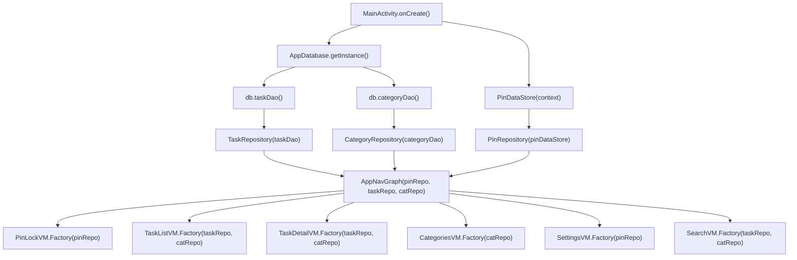

**为什么不用 Hilt/Dagger（Android 主流 DI 框架）？**

对于当前规模的应用（6 个 ViewModel、3 个 Repository、2 个 DAO），DI 框架引入的复杂度大于解决的问题。依赖图是浅层线性的——一切都从 `MainActivity` 流出。

| 方式 | 优点 | 缺点 |
|------|------|------|
| 手动 DI | 零注解处理开销、完全透明、易理解调试 | Activity 变成"上帝对象"、ViewModel Factory 样板代码多 |
| Hilt/Dagger | 自动管理生命周期和 Scope、测试支持好 | 注解处理器增加编译时间、学习曲线陡峭、生成的代码不透明 |

如果应用增长到 15+ 个 ViewModel 且需要 Scope 管理，迁移到 Hilt 将是自然选择。

---

## 9. 数据流转模式

### 响应式流（任务列表）

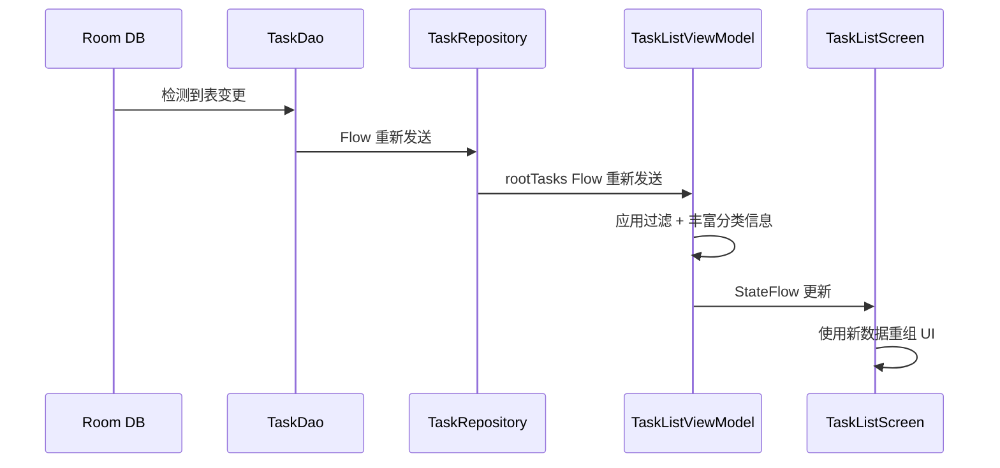

这是**单一数据源（Single Source of Truth）**模式。所有写入都进数据库，所有读取都响应数据库变化。没有额外的内存缓存导致数据不一致。

### 命令式流（创建任务）

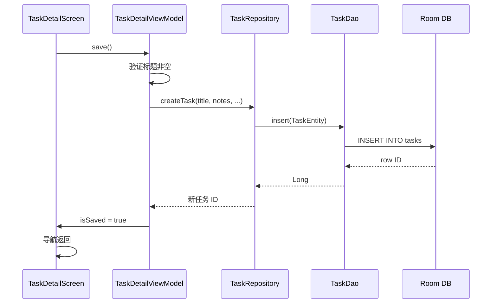

写入操作从调用方角度看是同步的（挂起函数），但响应式 Flow 确保任何打开中的列表页面能自动更新。

---

## 10. 安全：PIN 哈希

### 算法细节

```
输入："1234"

第 1 步：生成 16 个随机字节（盐值 salt）
  salt = [a7, 3f, 91, 2c, ...] (SecureRandom 生成)

第 2 步：哈希
  digest = SHA-256(salt + "1234".toByteArray())

第 3 步：编码
  stored = Base64(salt) + ":" + Base64(digest)
  → "pz+RLP7//v8=:Kj8s9Q2mWxYvNpR3tU6hA=="
```

### 为什么选 SHA-256？

SHA-256 **不是**专业的密码哈希算法（bcrypt/scrypt/argon2 更好），但对于 4 位数字 PIN（只有 10000 种组合），盐值是主要防御手段。SHA-256 配合随机盐值可以防止预计算的彩虹表攻击。对于 App 级别的 PIN（非网络认证），这是可接受的折中。

### 为什么用 SharedPreferences？

对于单个哈希字符串，加密 DataStore 或 SQLCipher 的开销是不成比例的。PIN 保护的是本地 App 访问权限，不是远程服务器认证——威胁模型是防止路人随手翻看，不是专业取证分析。

---

## 11. 关键技术决策

### 决策 1：Entity 直接作为 UI 模型

`TaskEntity` 和 `CategoryEntity` 直接在 UI 状态类中使用，没有映射为单独的 UI 模型。

**为什么？** 对于这个规模的应用，加一层映射转换只会增加样板代码，没有实际收益。Entity 是没有行为的数据类，UI 展示的字段和数据库存储的完全一样。当 UI 需要明显不同的数据形态时（比如多表联查的去规范化视图），转换层才有价值。

### 决策 2：优先级存为字符串而非枚举

优先级在 Room 中以 `String` 存储，而非枚举 + TypeConverter。

**为什么？** 字符串列可以直接在 SQL 层做排序（`CASE WHEN 'HIGH'...`），不需要加载全部数据到内存再排。枚举 TypeConverter 通常存序号（0, 1, 2），过滤排序都需要客户端映射。**代价**是丢失了编译时类型安全——如果有人写了 `"HIHG"` 这种拼写错误，编译不会报错。

### 决策 3：没有 Use Case 层

没有 `domain/usecase/` 或 `domain/interactor/` 目录。

**为什么？** Use Case 在以下情况有价值：同一段业务逻辑被多个 ViewModel 调用，或多 Repository 的编排逻辑很复杂。在这个应用里，每个 ViewModel 调用了不同的 Repository 方法，不存在跨 Repository 的编排逻辑，Repository 本身已经封装了数据访问模式。加一层 Use Case 只会增加没有意义的转发代码。

### 决策 4：手动 DI 而非 Hilt

**原因在第 8 节已详述。** 门槛是大约 10+ 个 ViewModel 且需要复杂的 Scope 管理时，Hilt 的优势才超过成本。

### 决策 5：Flow 共享使用 `WhileSubscribed(5000)`

所有列表类 ViewModel 使用 `SharingStarted.WhileSubscribed(5000)`。

**为什么？** 5 秒超时让上游数据库 Flow 在屏幕旋转等配置变更时保持活跃（旋转导致 Compose 销毁重建通常不到 1 秒）。如果是 `Eagerly`，Flow 在页面不可见时也保持活跃，浪费数据库资源。如果是 `Lazily`，每次配置变更都会重启 Flow，导致数据闪烁。

---

## 附录 A：文件地图

```
app/src/main/java/com/example/myapplication/
├── MyApp.kt                          Application + NotificationChannel + WorkManager 配置
├── MainActivity.kt                   单 Activity + 手动 DI 注入
├── data/
│   ├── datastore/PinDataStore.kt     SharedPreferences PIN 存储
│   ├── db/
│   │   ├── AppDatabase.kt            Room 数据库单例
│   │   ├── converter/Converters.kt   Long<->Date 类型转换器
│   │   ├── dao/TaskDao.kt            任务查询 + CRUD
│   │   ├── dao/CategoryDao.kt        分类查询 + CRUD
│   │   ├── entity/TaskEntity.kt      Tasks 表实体
│   │   └── entity/CategoryEntity.kt  Categories 表实体
│   └── repository/
│       ├── TaskRepository.kt         任务操作 + 任务树构建
│       ├── CategoryRepository.kt     分类操作
│       └── PinRepository.kt          PIN 验证/设置
├── domain/model/
│   ├── Priority.kt                   HIGH/MEDIUM/LOW 枚举
│   └── TaskWithSubtasks.kt           递归树节点
├── ui/
│   ├── theme/                        Material 3 主题 + 颜色 + 字体
│   ├── navigation/NavGraph.kt        路由 + NavHost + ViewModel 工厂
│   ├── component/                    7 个可复用组件
│   └── screen/                       6 个页面 + ViewModel 配对
├── worker/ReminderWorker.kt          WorkManager 通知 Worker
└── util/PinHasher.kt                 SHA-256 + salt PIN 哈希
```

## 附录 B：依赖版本

| Library | Version |
|---------|---------|
| Kotlin | 2.2.10 |
| AGP | 9.2.1 |
| Compose BOM | 2026.02.01 |
| Room | 2.7.1 |
| Navigation Compose | 2.9.6 |
| WorkManager | 2.10.0 |
| Kotlinx Coroutines | 1.10.1 |
| JUnit | 4.13.2 |
| Turbine | 1.2.0 |

---

*本文档基于源码分析生成，描述的是"已实现的架构"，而非"期望的架构"。*
